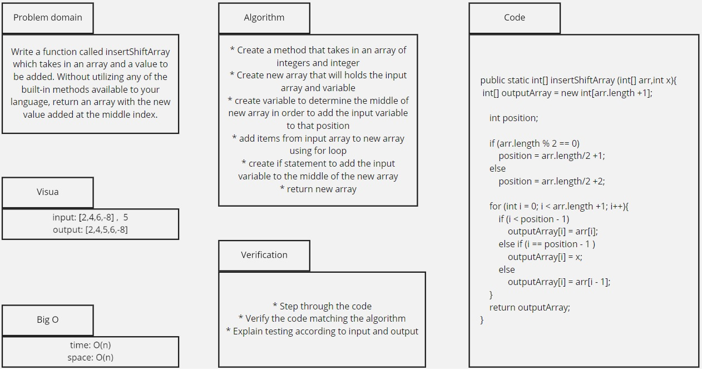

# Insert Shift Array
This challenge required to create a method that takes in an array of integers and integer variable and return new array that will add the variable input in the middle of the new array.

## Whiteboard Process

## Approach & Efficiency
