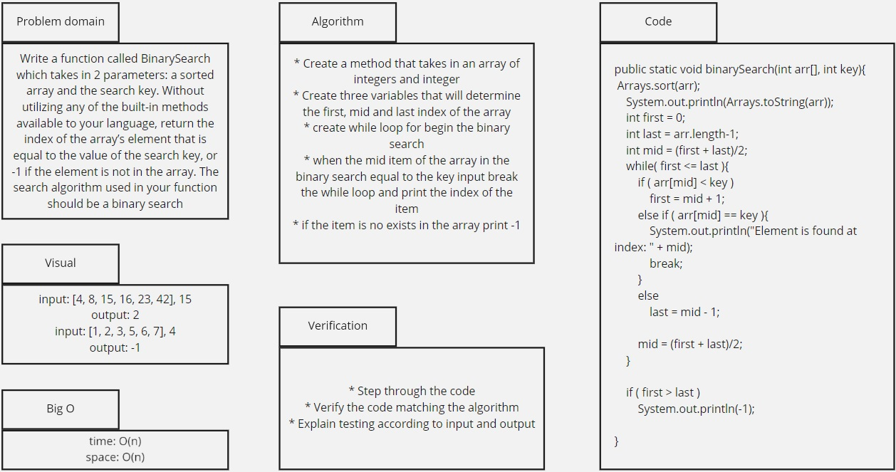

# Binary Search
This challenge required to use Binary Search in order to
find the index of the array element that is equal to the
value of the search key.

## Whiteboard Process

## Approach & Efficiency
